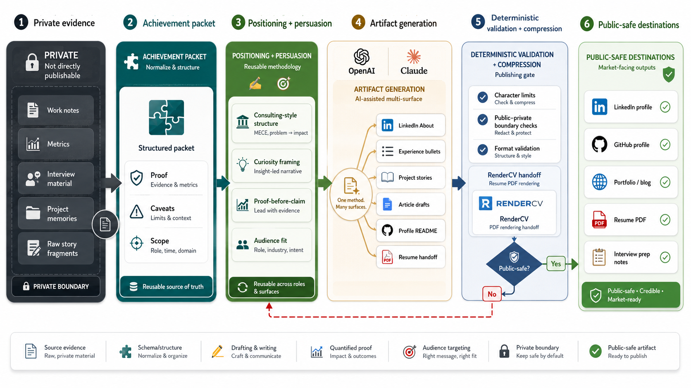

# ProofStack




Most career materials are written as summaries of what happened.

That is not enough. Good positioning turns real achievements into persuasive representations: structured clearly enough for a busy executive, emotionally legible enough for a reader to care, and specific enough that the claim feels earned.

ProofStack is a public-safe skill system for doing that with AI agents.

It starts from the source of truth:

```text
private work evidence
  -> structured achievement packet
  -> persuasive, sanitized representation
  -> resume, LinkedIn, portfolio, recruiter, or interview artifact
```

The skills encode reusable writing and persuasion principles: consulting-style top-down structure, narrative tension, SCQA, curiosity gaps, proof before claim, status-aware positioning, and direct-response copywriting patterns. The goal is to make achievement representation repeatable without leaking private details, overclaiming, or rewriting the same story from scratch for every surface.

## What It Helps With

- Structure messy work evidence before turning it into public persuasion.
- Preserve metrics, caveats, proof sources, and status distinctions so the writing stays credible.
- Keep private evidence separate from public methodology.
- Draft long-form project stories with narrative tension and reusable takeaways.
- Turn one achievement source into different persuasive views for different audiences.
- Create LinkedIn profile bios, About sections, Experience bullets, project descriptions, posts, articles, and visual/banner specs.
- Format and validate LinkedIn-ready assets against editable character limits and image specs.
- Hand off resume-ready content to RenderCV for YAML-driven PDF rendering without reimplementing RenderCV.
- Name and launch GitHub repos and GitHub profiles with product-style positioning.
- Keep the agent focused on representation principles instead of generic resume-writing advice.

This repo contains public-safe methodology and skills. Your real evidence belongs in a private repo.

## Install

Install the skills for Codex with `skills.sh`:

```bash
npx skills add https://github.com/ArthurZakirov/ProofStack --skill '*' -a codex -g -y
```

List available skills first:

```bash
npx skills add https://github.com/ArthurZakirov/ProofStack --list
```

For local development from a cloned repo, link skills into Claude Code, `.agents`, and Codex skill directories:

```bash
./scripts/setup-local-links.sh
```

Existing non-symlink paths are left untouched unless `--force` is used.

## Use

Start by turning a real achievement into a private achievement packet using the schema. Keep the packet private.

Then use the installed skill that matches the target artifact:

```text
Use article-leverage-story to turn this achievement packet into a confidentiality-safe article draft.
Use curiosity-bio-story to draft a LinkedIn About section from this sanitized achievement packet.
Use impact-bullets to turn this achievement packet into LinkedIn Experience bullets.
Use linkedin-content-validation to save, format, validate, and repair LinkedIn-ready content files.
Use rendercv-resume-handoff to turn resume-ready content into a RenderCV handoff.
Use github-repo-product-naming to choose a product name, repo slug, and tagline.
Use github-repo-launch-page to turn a repo into a launch-ready project page.
Use github-profile-authority-page to turn GitHub into a credible profile landing page.
Use architecture-diagram-gpt-imagegen to turn a system description or Mermaid flow into a polished diagram-image prompt.
```

The skills cover long-form project stories, profile bios, resume and LinkedIn bullets, audience positioning, repeatable work-model articulation, project/profile README positioning, visual banner specs, GitHub public positioning, and compression to strict limits.

The skill should help with the thinking behind the representation, not just the prose: what to lead with, what proof to reveal when, how to create contrast without arrogance, and how to extract the reusable operating principle from the story.

## LinkedIn Validation

LinkedIn limits change. This repo stores limits in `config/linkedin_limits.yaml` instead of hardcoding them into Python.

Use the deterministic workflow when drafting LinkedIn content into files:

```bash
python3 scripts/format_linkedin_text.py --write content
python3 scripts/format_linkedin_text.py --check content
python3 scripts/validate_linkedin_assets.py content
python3 scripts/validate_linkedin_assets.py content --config config/linkedin_limits.yaml
```

See `docs/linkedin_content_workflow.md` for the full repair loop.

## RenderCV Resume Rendering

This repo does not reimplement resume rendering. Use Career Positioning OS to prepare truthful, compressed, public-safe resume content, then use RenderCV for the YAML schema and PDF output.

Install the external RenderCV skill:

```bash
npx skills add rendercv/rendercv-skill --skill rendercv -a codex -g -y
```

Then use:

```text
Use rendercv-resume-handoff to prepare the resume content handoff.
Use rendercv to create or edit the RenderCV YAML file and render the PDF.
```

See `docs/rendercv_resume_workflow.md`.

## GitHub Public Positioning

Use the GitHub-specific skills when you want the repo, README, or profile itself to feel like a product.

- `github-repo-product-naming` for naming and renaming
- `github-repo-launch-page` for repository README and GitHub metadata
- `github-profile-authority-page` for the public GitHub profile landing page

See `docs/github_public_positioning.md`.

## Reference Material

Some external resources are useful as calibration material when iterating on resumes, LinkedIn copy, articles, and value framing:

- *The Google Resume* by Gayle Laakmann McDowell
- A Life Engineered
- Acquisition.com Offers Course / `$100M Offers`
- GitHub public positioning skills bundle

See `docs/reference_material.md` for how to use them with agents without copying source material or mixing private evidence into the public repo.

## Keep Private Data Out

Do not put real raw notes, employer details, internal links, private metrics, target jobs, applications, compensation, or review strategy in this repo.

Use fictional examples here. Keep real evidence in a private repo, then publish only reviewed and sanitized outputs.

## Example

See the dummy achievement examples for the packet shape:

```bash
cat examples/dummy-achievements.yaml
```
